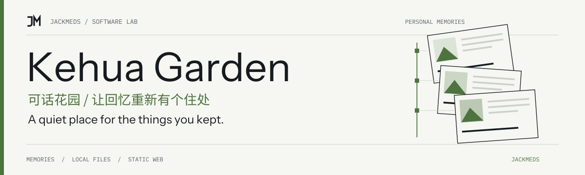
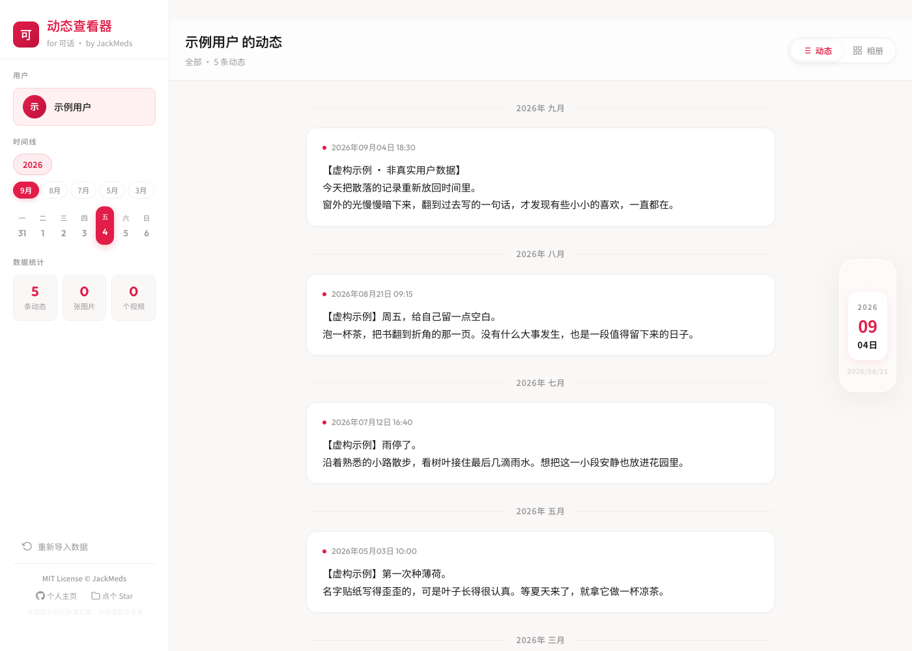

<!-- jackmeds-brand:start -->
<picture>
  <source media="(prefers-color-scheme: dark)" srcset="assets/brand/hero-dark.svg">
  
</picture>
<!-- jackmeds-brand:end -->

# 可话花园

让留在导出包里的日子，重新长成一座可以慢慢逛的花园。

可话停运后，文字、图片和情绪还留在你的导出文件里。可话花园把这些记录重新排成时间线与相册，让你在浏览器里安静地看看过去的自己。

[在线打开可话花园](https://jackmeds.github.io/kehua-memory-garden/) · [导入方法](#导入你的回忆) · [使用与部署说明](docs/guide.md) · [English summary](#english-summary)

## 花园里的样子



图中使用示例数据，不包含真实用户记录。你自己的导出内容由浏览器在本机读取和整理。

## 可以怎样逛

- **顺着时间回看。** 按年、月定位动态，在时间线中找回某一天。
- **让图片与视频聚在一起。** 切换相册，点开媒体查看大图或播放视频。
- **直接读原来的导出包。** 导入可话文件夹或 ZIP，保留原有目录结构即可。
- **下次接着看文字。** 浏览器保存轻量文字缓存；媒体仍从原文件读取，不建立云端资料库。

## 导入你的回忆

1. 打开[在线站点](https://jackmeds.github.io/kehua-memory-garden/)。
2. 在电脑上选择可话导出文件夹；在手机上，建议把完整导出文件夹压成 `.zip` 后导入。
3. 等待解析完成，从左侧时间线选择年月，或切换“动态”和“相册”。

请选择包含“我的动态”的导出文件夹，并保留年份文件和媒体子目录。这里只读取已有导出数据，不需要可话账号登录；如果还没有导出包，站点无法替你取回已停运服务中的内容。

找不到动态或图片时，先看[目录示例和常见问题](docs/guide.md#导出包结构)。

## 隐私与使用限制

解析、读取和展示导出内容都在浏览器中完成，应用没有上传这些内容的后端。在线站点仍需加载网页资源，当前页面也会请求 Google Fonts 字体；这与上传你的回忆内容是两回事。

文字和媒体路径会缓存到当前浏览器的 IndexedDB，图片和视频文件本身不会持久存入缓存。重新打开页面后，可能需要重新选择文件夹或导入 ZIP 才能恢复媒体。点击“重新导入数据”会清除应用缓存，不删除原始导出文件。

请保留原始导出包备份。大 ZIP 的解压与媒体索引会占用设备内存；遇到卡顿，优先在电脑上直接导入文件夹。可播放的视频格式由浏览器决定。目录授权与文件夹选择能力因浏览器而异，手机优先使用 ZIP。

## 本地运行与开发

项目使用 React、Vite、原生 CSS、JSZip 与 IndexedDB。使用 Node.js 20（与现有部署流程一致）：

```bash
git clone https://github.com/JackMeds/kehua-memory-garden.git
cd kehua-memory-garden
npm ci
npm run dev
```

打开终端提示的本地地址即可。生成静态站点并本地预览：

```bash
npm run build
npm run preview
```

构建输出在 `dist/`。GitHub Pages 部署、站点元信息和源码入口见[使用与部署说明](docs/guide.md)。提交问题时，可使用虚构文字与占位媒体提供最小复现，避免附带完整个人导出包。

## English summary

Kehua Memory Garden turns a Kehua export into a personal timeline and media gallery. [Open the app](https://jackmeds.github.io/kehua-memory-garden/), then select an export folder or ZIP; ZIP is recommended on mobile. Posts and media are parsed in your browser and are not uploaded by the app. Text is cached locally; media may need to be selected again after reopening. The hosted page loads web assets and Google Fonts. Keep your original export as a backup.

## 版权说明

当前仓库没有独立的 `LICENSE` 文件，具体授权范围尚待维护者明确。这里保留现有代码与资源的归属，不另行声明新的开源许可证。
